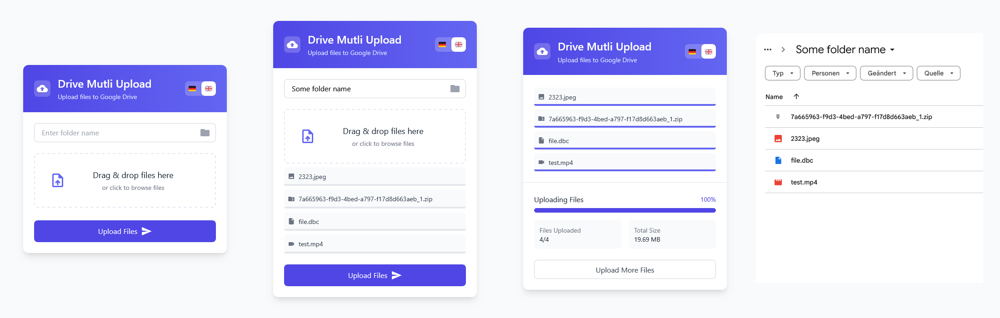

# drive-multi-upload
Upload multiple large files to Google Drive using Google Apps Script.  
Now also with a nice UI. :)

## Overview
This is a form that will take a folder name, create that folder under a hardcoded parent folder, and upload 1 or more large files (> 50 MB). The form uses Google Apps Script (GAS), in order to interface with google drive's api.

## Description
This form came from a need to provide an easy way for someone to upload large files to google drive via a simple interface accessible on any device. Originally I was creating files using the Google Drive DriveApp api but quickly realized that uploading larger files was not supported. It looked like the resumable upload option is what I wanted. I found some closely linked resources, but those examples would only upload one file at a time. This solution will upload multiple files simultaneously and put them in a new folder in the provided parent folder. The code uses the Google Drive DriveApp api to get an oAuth token, and to create the folders in the right place. Here are the general steps of the code:

1. Validate the form.
2. All files are loaded into the browser.
3. Using the hardcoded `uploadParentFolderId` to create a subfolder based on the provided name.
4. Divides the files up into chunks that can be sent one at a time to the server. Update the % updated display with progress.

## Getting Started
This form is made up of two files: `index.html`, and `code.gs`. Follow these steps to run them:
1. Go to http://script.google.com.
2. Click on "New Script" at the top left of the page.
3. Paste the contents of `code.gs` into the `code.gs` file that opens up.
4. Click "File" -> "New" -> "HTML file" and name it `index.html`.
5. Copy the contents of `index.html` into the newly created `index.html`.
6. Change `uploadParentFolderId` variable to a folder id from your google drive.
6. Deploy your code by going to "Publish" -> "Deploy as web app...".
7. Leave the defaults or modify them as you please.
8. Authorize the app by reviewing Permissions and allowing this script to modify your google drive. (If you see a "BACK TO SAFETY" button you should click "Advanced", then the link that says "unsafe").
9. Click on the "latest code" link to view the form. (you can always find this link again by going to "Publish" -> "Deploy as web app..." and clicking on the "latest code" link there).
10. Use the deploy link in an iframe to get rid of the message "This application was created by a Google Apps Script user".

## Acknowledgements
This form was mostly put together from work found in the following resources:
- https://github.com/tanaikech/Resumable_Upload_For_WebApps
- https://github.com/tanaikech/ResumableUploadForGoogleDrive_js
- https://github.com/CharlesPlucker/drive-multi-upload
